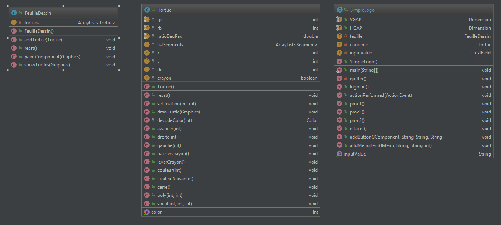

**Nom/Prénom Etudiant 1 : LAFAYE DE MICHEAUX Yoan **

**Nom/Prénom Etudiant 2 : LHOPITAL Sacha **

# Rapport TP4 - Projet

## Introduction

//Todo SLH

## Etude de l'existant



Liste de problèmes à résoudre :

- Certaines variables et méthodes sont inutilisées

- Certains nom de variables et de méthodes ne sont pas très clairs :
```java
private oldSrc.Tortue courante;
```

- Le code est à la fois écrit en Anglais et en Français (par la suite nous avons décidé d'écrire le code en Français) :
```java
public void addTortue(oldSrc.Tortue o) {
    tortues.add(o);
}
```

- Certains commentaires ne sont pas pertinents :
```java
/** quelques classiques */
```

- Certains commentaires ou morceaux de code ont été copier coller

- Il y a quelques morceaux de code  "elseif" que l'on peut simplifier :
```java
if (c.equals("Avancer")) {
    [...]
}
else if (c.equals("Droite")) {
    [...]
}
else if (c.equals("Gauche")) {
    [...]
}
else if (c.equals("Lever"))
    courante.leverCrayon();
else if (c.equals("Baisser"))
    courante.baisserCrayon();
// actions des boutons du bas
else if (c.equals("Proc1"))
    proc1();
else if (c.equals("Proc2"))
    proc2();
else if (c.equals("Proc3"))
    proc3();
else if (c.equals("Effacer"))
    effacer();
else if (c.equals("Quitter"))
    quitter();
```

- Certains nom de paramètres de méthodes ne sont pas pertinants :
```java
public void poly(int n, int a){[...]}
```

- Les getters et setters ne sont pas assez utilisés

- Certains calculs sont obsolètes et peuvent être remplacés en utilisant des librairies (Java.Math par exemple).

- Il y a aussi des problèmes d'indentations du code.

## Implémentation du MVC

Pour appliquer l’architecture MVC, nous avons réorganisé les éléments de l’application en trois package (modele, vue, controleur). 

//TODO Yoan : diagramme UML éventuellement ? 
+ expliquer l'arborescence des controleurs/vues
+ expliquer le lien vue/controleur/modèle
+ expliquer observer observé 
+ expliquer difficultés éventuelles

#### Modèle

Pour gérer les différentes Formes, nous avions mis en place une interface IForme qui permettais au controleur de simplement faire IForme.tracer(), plutôt que de devoir gérer le type de forme avec des méthodes différentes. Finallement se code a été supprimé car inutilisé dans notre projet final.

#### Controleur

#### Vue

## Extension du projet

#### Gestion de plusieurs tortues

//Todo yoan expliquer + problèmes rencontrés

#### Tortues autonomes

//Todo Yoan expliquer + problèmes rencontrés

#### Comportement de flocking

//Todo SLH

#### Comportement de flocking sectaire

//Todo SLH

#### Tests

//Todo SLH

## Conclusion

//Todo SLH
 