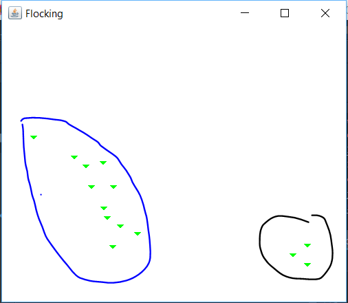
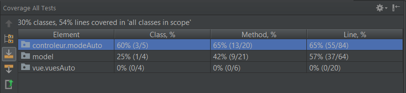

**Nom/Prénom Etudiant 1 : LAFAYE DE MICHEAUX Yoan **

**Nom/Prénom Etudiant 2 : LHOPITAL Sacha **

# Rapport TP4 - Projet

*Ce projet a été réalisé dans le cadre du cours d’ISI de Polytech Lyon - 4e Année du cycle d’Ingénieur Informatique.*

## Introduction

Ce rapport présente le compte rendu de développement et d'amélioration d'un projet de gestion de Tortues. Ce document présente notre travail, mais égalements les difficultés que nous avons rencontrés.
 
Nous commencerons par présenter les différents problèmes initialement présents dans le projet que nous avons résolu au fur et à mesure. 

Le projet comprend une application principale avec des interfaces utilisateurs en Swing. Le projet comprends également quelques tests. 

L'application implémente les notions suivantes : Pattern MVC, Pattern Observeur - Observé, Tests Unitaires, Code SMELL le plus propre possible. 
L'application implémente également les fonctionnalités suivantes : Gestion d'une multitude de Tortues (Mode manuel ou Automatique), Tortues Flocking (et Flocking Sectaire) et enfin un ensemble de tests, surtout concentré sur les fonctionnalités liées au flocking. 

Nous terminerons par une conclusion sur notre travail.


## Etude de l'existant


Liste de problèmes à résoudre :

- Certaines variables et méthodes sont inutilisées

- Certains nom de variables et de méthodes ne sont pas très clairs :
```java
private oldSrc.Tortue courante;
```

- Le code est à la fois écrit en Anglais et en Français (par la suite nous avons décidé d'écrire le code en Français) :
```java
public void addTortue(oldSrc.Tortue o) {
    tortues.add(o);
}
```

- Certains commentaires ne sont pas pertinents :
```java
/** quelques classiques */
```

- Certains commentaires ou morceaux de code ont été copier coller

- Il y a quelques morceaux de code  "elseif" que l'on peut simplifier :
```java
if (c.equals("Avancer")) {
    [...]
}
else if (c.equals("Droite")) {
    [...]
}
else if (c.equals("Gauche")) {
    [...]
}
else if (c.equals("Lever"))
    courante.leverCrayon();
else if (c.equals("Baisser"))
    courante.baisserCrayon();
// actions des boutons du bas
else if (c.equals("Proc1"))
    proc1();
else if (c.equals("Proc2"))
    proc2();
else if (c.equals("Proc3"))
    proc3();
else if (c.equals("Effacer"))
    effacer();
else if (c.equals("Quitter"))
    quitter();
```

- Certains nom de paramètres de méthodes ne sont pas pertinants :
```java
public void poly(int n, int a){[...]}
```

- Les getters et setters ne sont pas assez utilisés

- Certains calculs sont obsolètes et peuvent être remplacés en utilisant des librairies (Java.Math par exemple).

- Il y a aussi des problèmes d'indentations du code.

## Implémentation du MVC

Pour appliquer l’architecture MVC, nous avons réorganisé les éléments de l’application en trois package (modele, vue, controleur). 
 
Afin de permettre une mise a jour dynamique de la vue, un utilise un pattern observeur/observé.

La chaque Tortue déclarée est observé par une vue associée qui est notifiée à chaque changement de direction ou de position afin de la mettre à jour.

Le controleur est en charge de la gestion des actions, un event sur la vue (clique sur un button, une tortue ...) appelle automatiquement une methode du controlleur associé. En cas de paramettres entré par l'utilisateur (distance et angle), la vue est également en charge de verifier si l'entrée est correcte.

Le controleur modifie également le modele en appelant les methodes de changement de direction (gauche(), droite()) et de déplacement (avancer()).

Certains problèmes sont remontés par l'utilisation du patern observeur/observé car nous avions une boucle infinie de notification. Cette boucle etait due à une mauvaise implementation du patern MVC.

#### Modèle


Pour gérer les différentes Formes, nous avions mis en place une interface IForme qui permettais au controleur de simplement faire IForme.tracer(), plutôt que de devoir gérer le type de forme avec des méthodes différentes. Finallement se code a été supprimé car inutilisé dans notre projet final.

#### Controleur


#### Vue


## Extension du projet

#### Gestion de plusieurs tortues

Le but etait de pouvoir afficher lusieurs tortues et de pouvoir les selectionner de maniere independante.
La technique utilisée est d'aficher des JComponent qui ne sont en charge que du dessin de la tortue (triangle et orientation) puis 
de placer ces JComponent dans un JPannel de maniere fixée (avec la methode setBounds). En utilisant cette technique, nous avont acces aux diférents évenements sur chaque JComponent dont le Clic ... A la détecton d'un clic on peut donc selectionner une tortue de maniere simple.

#### Tortues autonomes

Les tortues autonomes sont des tortues qui se mettent à jour de maniere réguliere selon un algorythe précis (aléatoire, flocking ...). Afin d'automatiser les mises à jours, chaque controlleur execute à intervale reguliere la methode miseAJour qui est en charge de mettre à jour chque tortue presente sur l'afichage. Le mode auto fonctione sur une base aléatoire (avancer de x, tourner a droite de y, tourner a gauche de z, [x,y,z] etant selectionnés aléatoirement).

````java
 Timer timer = new Timer();
        TimerTask myTask = new TimerTask() {
            @Override
            public void run() {
                miseAJour();
            }
        };

        timer.schedule(myTask, DELAI, PERIODE);
````


#### Comportement de flocking

Notre objectif, ici, était de proposer un mode automatique à l'utilisateur où un certain nombre de tortues se déplacent avec un comportement de [flocking](https://en.wikipedia.org/wiki/Flocking_(behavior)), à la manière des oiseaux. 

Au départ nous pensions implémenter une nouvelle classe de tortues qui hériteraient de *Tortue* pour pouvoir réutiliser les méthodes du controleur principal. Cette idée a très vite était abandonnée car en réalité, le comportement de flocking ne change pas vraiment les méthodes de déplacement d'une tortue classique. 

Dans un second temps, nous avions pensé à implémenter le flocking sous forme d'un comportement (où une tortue possèderait un comportement disons normal et flocking), mais là encore nous nous sommes rendus compte que cela modifiait beaucoup de code existant pour au final ne pas vraiment nous faciliter le développement de ce nouveau comportement. 

Finallement, nous avons opté pour une implémentation plus classique. Disposant déjà d'un mode automatique pour gérer des tortues qui se déplacent aléatoirement (avec une méthode de mise à jour qui est appellée automatiquement par un timer : Cf. partie précédente), nous avons décidé de rajouter un controleur *ControleurFeuilleFlocking* qui implémenterais le même principe sauf qu'au lieu de se déplacer aléatoirement, les tortues suivent un comportement de flocking. Pour éviter la redondance de code avec *ControleurFeuilleAuto* nous avons créé une classe abstraite *ControleurModeAuto* comme suit : 

```java
public abstract class ControleurModeAuto extends ControleurFeuilleDessin {

    private static final int DELAI = 50;
    private static final int PERIODE = 50;

    public ControleurModeAuto() {
        super();

        Timer timer = new Timer();
        TimerTask myTask = new TimerTask() {
            @Override
            public void run() {
                miseAJour();
            }
        };

        timer.schedule(myTask, DELAI, PERIODE);
    }

    public abstract void miseAJour();
    public abstract void ajouterToutesLesTortues();
}
```

Les méthodes relatives au comportement du flocking sont définies dans le *ControleurFeuilleFlocking* et sont appellées dans la fonction miseAJour : 

```java
/***
 * Déplace les tortues selon le flocking
 * Déplace les tortues selon le flocking
 */
@Override
public void miseAJour(){
    if(!enRoute){
        return;
    }

    for (Tortue tortue : getTortues()) {

        int directionMoyenne = getDirectionMoyenne(tortue); //Calcul la direction moyenne que la tortue doit suivre, en fonction de ses voisins
        int directionSeparation = getDirectionSeparation(tortue); //Calcul la direction à prendre pour ne pas rentrer en collision avec une autre tortue
        int vitesseCohesion = getVitesseCohesion(tortue); //Récupère la vitesse de cohésion des tortues

        tortue.setVitesse(tortue.getVitesse() + vitesseCohesion + directionMoyenne + directionSeparation);
        tortue.setDir(directionMoyenne + directionSeparation);
        tortue.avancer(DISTANCE_BASE);
    }
}
```

Assez rapidement, comme toutes les tortues finissent par se voir mutuellement dans leur champs de vision, des groupes de tortues se forment suivent la même direction jusqu'à ce que toutes les tortues se suivent comme un unique groupe. 



Au départ, pour mettre en place le flocking, nous avons suivi des pseudo-algorithmes sur internet et nous avons essayé d'implémenter une structure avec des Vecteurs pour modéliser la position et la direction des Tortues. Nous avons fini par abandonner car cette implémentation modifiait toute la structure de notre code précédent et il était possible de réaliser un flocking fonctionnel tout en conservant la modification originale. Néanmoins, notre comportement n'est pas tout à fait parfait, et c'est peut-être aussi à cause de notre façon de modéliser - calculer les directions des tortues à suivre. 

#### Comportement de flocking sectaire

Nous souhaitions par la suite que les tortues appliquent un comportement de flocking uniquement avec des voisines qui sont de la même couleur qu'elles. 

Grâce à notre modélisation précédente, il nous as suffit d'ajouter un *ControleurFeuilleFlockingSectaire* qui hérite du *ControleurFeuilleFlocking* classique et override la méthode qui instancie toutes les tortues sur l'affichage. 

```java
public class ControleurFeuilleFlockingSectaire extends ControleurFeuilleFlocking {

    private static int NB_TORTUESPARCOULEUR = 10;

    public ControleurFeuilleFlockingSectaire(){
        super();
        démarrer();
    }

    @Override
    public void ajouterToutesLesTortues() {
        for(int i = 0 ; i < NB_TORTUESPARCOULEUR; i++){
            Tortue tNoire = new Tortue();
            tNoire.setCouleur(Color.BLACK);
            ajouterTortue(tNoire);
            Tortue tRouge = new Tortue();
            tRouge.setCouleur(Color.RED);
            ajouterTortue(tRouge);
            Tortue tVerte = new Tortue();
            tVerte.setCouleur(Color.GREEN);
            ajouterTortue(tVerte);
            Tortue tBleue = new Tortue();
            tBleue.setCouleur(Color.BLUE);
            ajouterTortue(tBleue);
        }
    }
}
```

Pour le comportement de flocking classique, nous avions définie une méthode privée *tortuesPeuventSeSuivre(Tortue tortue1, Tortue tortue2)* qui retournait *true* si les tortues se voient et *false* sinon. 
Pour être sûr que les tortues ne se suivent que si elles sont de la même couleur, nous avons juste eu besoin de rajouter une condition dans cette méthode :  

```java
//Si les tortues ne sont pas de la même couleur : elles ne se suivent pas
if(!tortue1.getCouleur().equals(tortue2.getCouleur())) {
    return false;
}
```

Au départ nous avons surchargé la méthode dans la classe *ControleurFeuilleFlockingSectaire* mais enfaite on peut directement mettre la condition dans le controleur parent car cette condition n'affecte pas la fonctionnalité précédente. 

#### Tests

Enfin, en complément de notre application, nous avons décidé d'implémenter quelques tests avec JUnit. 

Dans un premier temps nous avons testé *ControleurFeuilleDessin* en mockant une *VueFeuille* et une *Tortue*. Nous avons ainsi réalisé un test simple pour vérifier que la méthode *ajouterTortue* avait le bon comportement. 

Puis nous avons décidé de tester le controleur en charge du flocking car c'est une fonctionnalité très sensible. Nous avons là aussi utilisé les Mocks. 
En plus des Mocks, nous avons eu beaucoup de mal à tester certaines méthodes de la classe car elles étaient privées. En effet, les méthodes qui sont les plus importantes sont privées car elle ne sont accessible que depuis la méthode de *miseAJour()*. Pour pallier à ce problème, nous avons utilisé la méthode de **Reflection** qui permet de rendre les méthodes accesible pendant les tests. 

Par manque de temps, nous n'avons pas réalisé "beaucoup" de tests, surtout concernant l'interface avec l'utilisateur. C'est sans doute ce qui constitue la plus grande faiblesse de notre projet.  

## Conclusion

Ce projet a été l’occasion pour nous d'améliorer une application en profondeur et de réellement nous rendre compte de l'importance que nous devons donner aux principes de développement Clean. Nous avons constaté que c'est un travail, long, minutieux et murement réfléchis, mais que l'application ou le projet n'en ressort que meilleur. La rétrospective ci-après donne une idée de la satisfaction que nous retirons de ce projet, bien qu'il ne soit pas parfait :

- **Lisibilité** : Bonne
- **DRY** : Bon
- **Optimisation** : Assez Bon, peut-être que l'on peut encore l'améliorer au niveau du MVC (et plus particulièrement VC). 
- **Testabilité** : Bonne
- **SOLID** : Assez Bon, plus de tests doivent permettrent de définir si l'application est correctement développée ou si il reste du travail
- **Testé** : A Améliorer, code coverage actuel : 



- **Documenté** : Bon

 